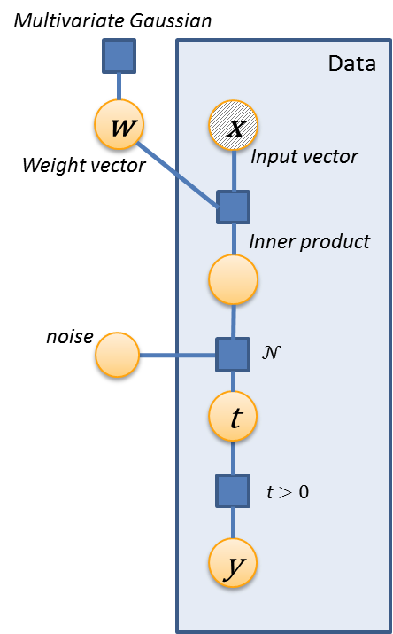

---
layout: default 
--- 
[Infer.NET user guide](index.md) : [Tutorials and examples](Infer.NET tutorials and examples.md)

[Page 1](Image classifier example.md) \| Page 2 \| [Page 3](Image classifier test model.md) \| [Page 4](Image classifier inference.md)

## Bayes Point Machine

The [Bayes Point Machine](http://research.microsoft.com/apps/pubs/default.html?id=65611), as implemented in this example, is represented by the following factor graph:



**w** is a vector Gaussian variable having prior with a multivariate Gaussian prior. For each data point, t is a latent variable formed by the inner product of **w** with the corresponding feature vector **x**. Adding noise then gives the latent variable y which is thresholded at 0 to produce a true ( ≥ 0) or false (< 0) answer which we observe during training.

This model is easily implemented in Infer.NET with the following C# code found in the constructor method for the BayesPointMachine class.

```csharp
// Training model  
nTrain = Variable.New<int>().Named("nTrain");  
Range trainItem = new Range(nTrain);  
trainingLabels = Variable.Array<bool>(trainItem).Named("trainingLabels");  
trainingItems = Variable.Array<Vector>(trainItem).Named("trainingItems");  
weights = Variable.Random(new VectorGaussian(new Vector(nFeatures),  
    PositiveDefiniteMatrix.Identity(nFeatures))).Named("weights");  
trainingLabels[trainItem] = Variable.IsPositive(  
    Variable.GaussianFromMeanAndVariance(  
        Variable.InnerProduct(weights, trainingItems[trainItem]), noise));
```

The variables themselves are members of the BayesPointMachine class. `nTrain`, which corresponds to N (the number of data points), is also specified as a variable, but the setting of its observed value is deferred until run-time.

`trainItem` is a locally defined Range object - a [range](Arrays and ranges.md) allows you to express repeated identical parts of your model in a succinct way. Often (as in this case) ranges are used to index data points in our training set.

`trainingLabels(type VariableArray<bool>)` and `trainingItems(type VariableArray<Vector>)` are, respectively, the observed output labels **l** and feature vectors **x** for our data set . As with `nTrain`, we defer setting these labels and feature vectors until run-time.

weights is the weight vector **w** which is defined with a prior having zero mean and identity positive definite precision matrix. If we wanted to be more general, we could make this prior a given in our model and pass down the mean vector **m** and precision matrix **p**. We write the factor as if we were taking a random sample from this prior distribution. The goal of the inference will be to infer the posterior distribution of **w** based on the observations.

The final line in this model definition combines the **InnerProduct** factor, the **Gaussian** noise factor, and the **IsPositive** factor into one expression, the result of which is then equated to the observation. Unraveling this from the innermost expression, we see that first we apply the `Variable.InnerProduct` method to get the latent variable t, we then apply the `Variable.GaussianFromMeanAndVariance` method to define the noisy latent variable y, whose sign is computed by `Variable.IsPositive`. The resulting implicit bool random variable is then equated to the observation. There are several points to note in this last step:

1.  The `trainItem` range allows for a very succinct statement that the expression is repeated for all indices in the range.
2.  weights is not indexed by `trainItem` because there is only one copy of **w** across all data points
3.  t and y are implicit in the final expression. You can, of course, split up the expression - either for reasons of clarity, or if you want to recover their posteriors.
4.  noise is a parameter passed down to the BayesPointMachine constructor, and so it is hard-wired into a particular instance of the model.

In preparation for inference, our BayesPointMachine constructor also creates an inference engine which contains the inference parameters we want to use for training:

```csharp
trainEngine = new InferenceEngine(new ExpectationPropagation());  
trainEngine.NumberOfIterations = 5;
```

We specify that we want to use Expectation Propagation as our algorithm, and that we only want to do 5 passes through the data when learning the weight posteriors (experience with these types of models shows that this is usually sufficient).

<br/>
[Page 1](Image classifier example.md) \| Page 2 \| [Page 3](Image classifier test model.md) \| [Page 4](Image classifier inference.md)
