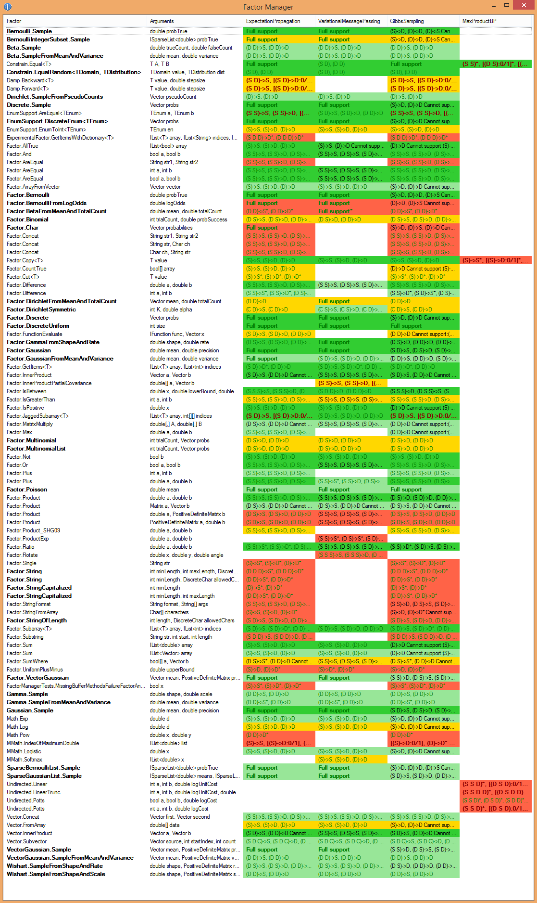

---
layout: default 
--- 
[Infer.NET user guide](index.md) : [Factors and Constraints](Factors and Constraints.md)

## List of factors and constraints

This screen shot shows a list of factors and constraints available, along with their support when used in different algorithms. In the list, 'S' stands for stochastic (unknown) and 'D' stands for deterministic (known) - for example **(S S)->D** denotes calling a factor with two unknown arguments where the result is known. If a pattern has a **\*** next to it, it means it does not support being in a condition block (if, case or switch). If a factor is shown as having full support but is marked with **\*** then it is not supported in a condition block in all cases.

This list can be useful in helping you choose an inference algorithm as described in [working with different inference algorithms](Working with different inference algorithms.md). You can see the most up-to-date list by calling **InferenceEngine.ShowFactorManager()**, which will also show user-defined factors and constraints. Factors with generic parameters are not always shown correctly in this list.

Where a factor is described as "Cannot support" it is not possible (or not known) how to support such a factor in the particular algorithm or stochasticity pattern. If you try and use such a factor, then you will get a specific error message explaining why it is not possible to use it with that algorithm.

The background colours for each factor and algorithm give an indication of the [Quality Band](Quality bands.md) of the factor as shown in the key below. As there are several different message operator methods for each factor (reflecting stochastic/deterministic values), the colour codes only the maximum quality band for each factor. For example, the Factor.Product factor shows mature support, but there will be some scenarios (for example when the messages are Gaussian and Beta rather than Gaussian and Gaussian) where the quality is experimental. To see this level of detail, you can look at the quality attributes in the source code for the message operators, or you can look at the warning messages given by the Model compiler.

| **Quality Band** |    Color    |
|:----------------:|:-----------:|
|      Mature      |    green    |
|      Stable      | light green |
|     Preview      |   yellow    |
|   Experimental   |     red     |
|   Not supported  |    white    |

